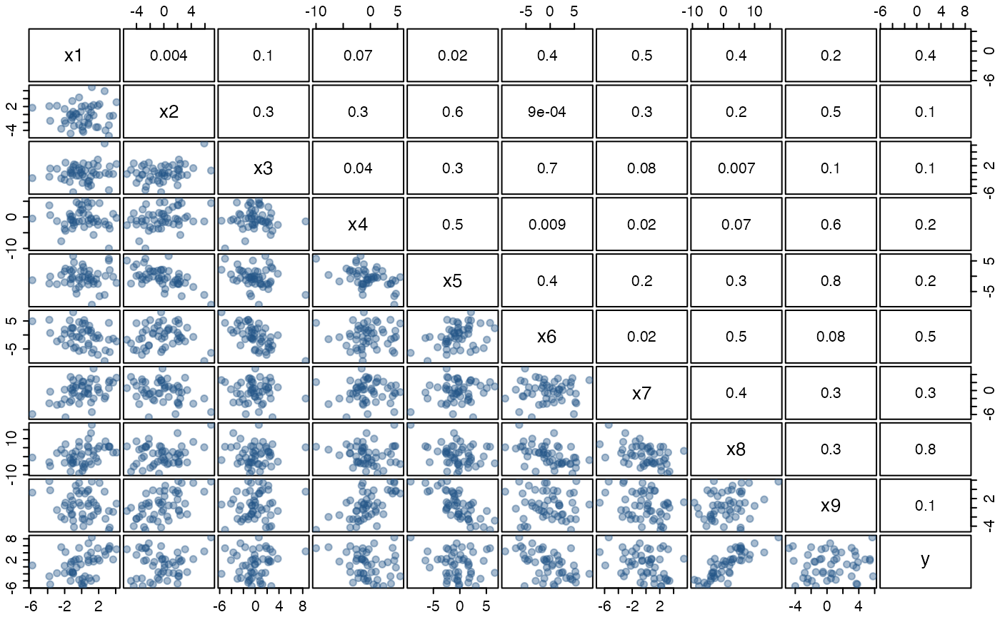

# Artificial example

The artificially generated data set was originally designed to emphasise
statistical deficiencies in stepwise procedures, but here it will be
used to highlight the utility of the various procedures and plots
provided by **mplot**. The data set and details of how it was generated
are provided with the **mplot** package.

``` r

# install.packages("mplot")
data("artificialeg", package = "mplot")
help("artificialeg", package = "mplot")
```

A scatterplot matrix of the data and the estimated pairwise correlations
are given in the [pairs plot](#fig:pairsplot) below. There are no
outliers and we have not positioned the observations in a subspace of
the artificially generated data set. All variables, while related,
originate from a Gaussian distribution. Fitting the full model yields no
individually significant variables.

``` r

library("mplot")
data("artificialeg")
full.model = lm(y ~ ., data = artificialeg)
round(summary(full.model)$coef, 2)
```

    ##             Estimate Std. Error t value Pr(>|t|)
    ## (Intercept)    -0.10       0.33   -0.31     0.76
    ## x1              0.64       0.69    0.92     0.36
    ## x2              0.26       0.62    0.42     0.68
    ## x3             -0.51       1.24   -0.41     0.68
    ## x4             -0.30       0.25   -1.18     0.24
    ## x5              0.36       0.60    0.59     0.56
    ## x6             -0.54       0.96   -0.56     0.58
    ## x7             -0.43       0.63   -0.68     0.50
    ## x8              0.15       0.62    0.24     0.81
    ## x9              0.40       0.64    0.63     0.53

Performing default stepwise variable selection yields a model with all
explanatory variables except \\x_8\\. As an aside, the dramatic changes
in the p-values indicate that there is substantial interdependence
between the explanatory variables even though none of the pairwise
correlations in the [pairs plot](#fig:pairsplot) are particularly
extreme.

``` r

par(mar=c(0,0,0,0), mgp=c(1,0.5,0), tcl=-0.3, bg = "transparent")
panel.cor <- function(x, y, digits=1, prefix="", cex.cor, ...)
{
  usr <- par("usr"); on.exit(par(usr = usr))
  par(usr = c(0, 1, 0, 1))
  r <- abs(cor(x, y))
  txt <- format(c(r, 0.123456789), digits=digits)[1]
  txt <- paste("", txt, sep="")
  text(0.5, 0.5, txt, cex = 1)
}
pairs(artificialeg, upper.panel = panel.cor, 
      pch = 19, col = '#22558866', oma = c(1.5,1.5,1.5,1.5),
      cex.labels = 1.25, gap = 0.2)
```



*Figure: scatterplot matrix of the artificially generated data set with
estimated correlations in the upper right triangle. The true data
generating process for the dependent variable is \\y=0.6\\ x_8 +
\varepsilon\\ where \\\varepsilon\sim\mathcal{N}(0,2^2)\\.*

``` r

step.model = step(full.model, trace = 0)
round(summary(step.model)$coef, 2)
```

    ##             Estimate Std. Error t value Pr(>|t|)
    ## (Intercept)    -0.11       0.32   -0.36     0.72
    ## x1              0.80       0.19    4.13     0.00
    ## x2              0.40       0.18    2.26     0.03
    ## x3             -0.81       0.19   -4.22     0.00
    ## x4             -0.35       0.12   -2.94     0.01
    ## x5              0.49       0.19    2.55     0.01
    ## x6             -0.77       0.15   -5.19     0.00
    ## x7             -0.58       0.15   -3.94     0.00
    ## x9              0.55       0.19    2.90     0.01

The true data generating process is, \\y = 0.6\\x\_{8} + \varepsilon\\,
where \\\varepsilon\sim\mathcal{N}(0,2^2)\\. The bivariate regression of
\\y\\ on \\x\_{8}\\ is the more desirable model, not just because it is
the true model representing the data generating process, but it is also
more parsimonious with essentially the same residual variance as the
larger model chosen by the stepwise procedure. This example illustrates
a key statistical failing of stepwise model selection procedures, in
that they only explore a subset of the model space so are inherently
susceptible to local minima in the information criterion ([Harrell,
2001](#ref-Harrell:2001)).

Perhaps the real problem with of stepwise methods is that they allow
researchers to transfer all responsibility for model selection to a
computer and not put any real thought into the model selection process.
This is an issue that is also shared, to a certain extent with more
recent model selection procedures based on regularisation such as the
lasso and least angle regression ([Tibshirani,
1996](#ref-Tibshirani:1996); [Tibshirani et al.,
2004](#ref-Tibshirani:2004)), where attention focusses only on those
models that are identified by the path taken through the model space. In
the lasso, as the tuning parameter \\\lambda\\ is varied from zero to
\\\infty\\, different regression parameters remain non-zero, thus
generating a path through the set of possible regression models,
starting with the largest *optimal* model when \\\lambda=0\\ to the
smallest possible model when \\\lambda=\infty\\, typically the null
model because the intercept is not penalised. The lasso selects that
model on the lasso path at a single \\\lambda\\ value, that minimises
one of the many possible criteria (such as 5-fold cross-validation, or
the prediction error) or by determining the model on the lasso path that
minimises an information criterion (for example BIC).

An alternative to stepwise or regularisation procedures is to perform
exhaustive searches of the model space. While exhaustive searches avoid
the issue of local minima, they are computationally expensive, growing
exponentially in the number of variables \\p\\, with more than a
thousand models when \\p=10\\ and a million when \\p=20\\. The methods
provided in the **mplot** package and described in the remainder of the
article go beyond stepwise procedures by incorporating exhaustive
searches where feasible and using resampling techniques to provide an
indication of the stability of the selected model. The **mplot** package
can feasibly handle up to 50 variables in linear regression models and a
similar number for logistic regression models when an appropriate
transformation (described in the [birth weight
example](https://garthtarr.github.io/mplot/articles/birthweight.md)) is
implemented.

#### References

Harrell, F. E. (2001). *Regression modeling strategies: With
applications to linear models, logistic regression, and survival
analysis*. New York: Springer-Verlag.

Tibshirani, R. J. (1996). Regression shrinkage and selection via the
lasso. *Journal of the Royal Statistical Society: Series B
(Methodological)*, 267–288.

Tibshirani, R. J., Johnstone, I., Hastie, T., & Efron, B. (2004). Least
angle regression. *The Annals of Statistics*, 32(2), 407–499.
DOI:[10.1214/009053604000000067](https://doi.org/10.1214/009053604000000067)
