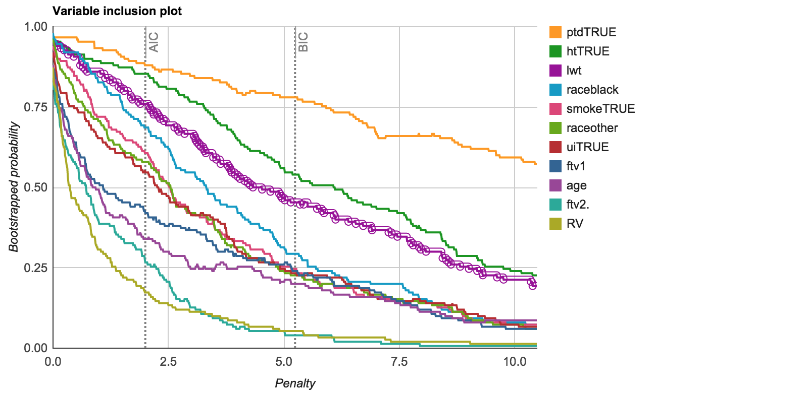
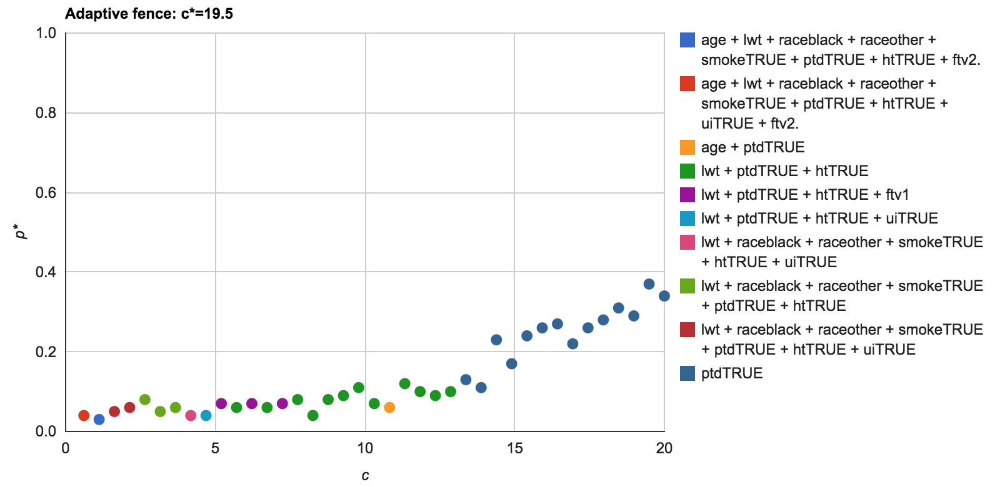
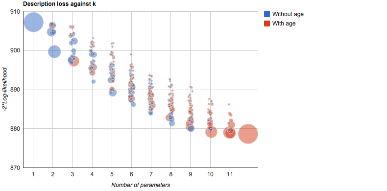

The `birthwt` dataset from the **MASS** package has data on 189 births at the Baystate Medical Centre, Springfield, Massachusetts during 1986 [@Venables:2002].  The main variable of  interest is low birth weight, a binary response variable `low` [@Hosmer:1989book].  We have taken the same approach to modelling the full model as in @Venables:2002, where `ptl` is reduced to a binary indicator of past history and `ftv` is reduced to a factor with three levels.

```{r, message = FALSE}
data("birthwt", package = "MASS")
bwt <- with(birthwt, {
  race <- factor(race, labels = c("white", "black", "other"))
  ptd <- factor(ptl > 0)
  ftv <- factor(ftv)
  levels(ftv)[-(1:2)] <- "2+"
  data.frame(low = factor(low), age, lwt, race, smoke = (smoke > 0), ptd, ht = (ht > 0), ui = (ui > 0), ftv)
})
options(contrasts = c("contr.treatment", "contr.poly"))
bw.glm <- glm(low ~ ., family = binomial, data = bwt)
round(summary(bw.glm)$coef, 2)
```


<!-- <div id="fig:birthwt"> -->
<!--  -->
<!--  -->
<!--  -->

<!-- </div> -->
<!-- _Figure: birth weight example._ -->

The `vis` and `af` objects are generated using the fitted full model object as an argument to the `vis()` and `af()` functions.  Because this is very computationally intensive, the results have been saved in an RData file which can then be subsequently reloaded for future plotting.

```{r, eval = FALSE}
af.bw = af(bw.glm, B = 150, c.max = 20, n.c = 40)
vis.bw = vis(bw.glm, B = 150)
save(bw.glm, af.bw, vis.bw, file = "bw_main.RData")
```

The results are shown below in the interactive plots.  Note that they they display the larger set of variables more clearly than the static plot methods (where the legend might overwhelm the plot).  An interactive plot is obtained using the `interactive = TRUE` parameter. As this is being rendered in an rmarkdown document, we use the rmarkdown chunk option `results = "asis"` along with the additional `tag = "chart"` parameter in the `plot()` function.  

```{r, results = "asis", message=FALSE}
load("bw_main.RData")
plot(vis.bw, which = "vip", interactive = TRUE, tag = "chart")
```

In this example, it is far less clear which is the best model, or if indeed a _best model_ exists.  It is possible to infer an ordering of variable importance from the variable inclusion plots, but there is no clear cutoff as to which variables should be included and which should be excluded. The `ptdTRUE` variable is clearly important.  It's less obvious that the `htTRUE` and `lwt` variables are important as they are in the vicinity of the redundant variable curve (`RV`). The other variables lie below the  redundant variable curve with `ftv2+` clearly the least important variable.  

```{r, results = "asis", message=FALSE}
plot(vis.bw, which = "boot", highlight = "htTRUE", interactive = TRUE, tag = "chart")
```

In the model stability plot (below) the only dominant (non-trivial, i.e. not the full model or the null model) is the simple linear regression with `ptdTRUE` as the explanatory variable. In models of size 3, there are a range of competing models that perform similarly well. 

```{r, results = "asis", message=FALSE}
plot(af.bw, interactive = TRUE, tag = "chart")
```

In the adaptive fence plot, the only model more complex than a single covariate regression model that shows up with some regularity is the model with `lwt`, `ptd` and `ht`, though at such low levels, it can hardly be considered as a region of stability.  This model also stands out slightly in the model stability plot, where it is selected in 6% of bootstrap resamples and has a slightly lower description loss than other models of the same dimension.  It is worth recalling that the bootstrap resamples generated for the adaptive fence are separate from those generated for the model stability plots.  Indeed the adaptive fence procedure relies on a parametric bootstrap, whereas the model stability plots rely on an exponential weighted bootstrap.  Thus, to find some agreement between these methods is reassuring.

Stepwise approaches using AIC or BIC yield conflicting models, depending on whether the search starts with the full model or the null model.  As expected, the BIC stepwise approach returns smaller models than AIC, selecting the single covariate logistic regression, `low ~ ptd`, in the forward direction and the larger model, `low ~ lwt + ptd + ht` when stepping backwards from the full model.  Forward selection from the null model with the AIC yielded `low ~ ptd + age + ht + lwt + ui` whereas backward selection the slightly larger model, `low ~ lwt + race + smoke + ptd + ht + ui`.   Some of these models appear as features in the model stability plots.  Most notably the dominant single covariate logistic regression and the model with `lwt`, `ptd` and `ht` identified as a possible region of stability in the adaptive fence plot.  The larger models identified by the AIC are reflective of the variable importance plot in that they show there may still be important information contained in a number of other variables not identified by the BIC approach.

@Calcagno:2010 also consider this data set, but they allow for the possibility of interaction terms.  Using their approach, they identify _two_ best models

```
low ~ smoke + ptd + ht + ui + ftv + age + lwt + ui:smoke + ftv:age
low ~ smoke + ptd + ht + ui + ftv + age + lwt + ui:smoke + ui:ht + ftv:age
```

As a general rule, we would warn against the `.*.` approach, where all possible interaction terms are considered, as it does not consider whether or not the interaction terms actually make practical sense.  @Calcagno:2010 conclude that "Having two best models and not one is an extreme case where taking model selection uncertainty into account rather than looking for a single best model is certainly recommended!"  The issue here is that the software did not highlight that these models are  identical as the `ui:ht` interaction variable is simply a vector of ones, and as such, is ignored by the GLM fitting routine.

As computation time can be an issue for GLMs, it is useful to approximate the results using weighted least squares [@Hosmer:1989].  In practice this can be done by fitting the logistic regression and extracting the estimated logistic probabilities, $\hat{\pi}_{i}$.  A new dependent variable is then constructed,

$$z_{i} = \log\left(\frac{\hat{\pi}_{i}}{1-\hat{\pi}_{i}}\right)  + \frac{y_{i}-\hat{\pi}_{i}}{\hat{\pi}_{i}(1-\hat{\pi}_{i})},$$ 

along with observation weights $v_{i}=\hat{\pi}_{i}(1-\hat{\pi}_{i})$. For any submodel $\alpha$ this approach produces the approximate coefficient estimates of @Lawless:1978 and enables us to use the **leaps** package to perform the computations for best subsets logistic regression as follows.

```{r}
pihat = bw.glm$fitted.values
r = bw.glm$residuals 
z = log(pihat/(1 - pihat)) + r
v = pihat*(1 - pihat)
nbwt = bwt
nbwt$z = z
nbwt$low = NULL
bw.lm = lm(z ~ ., data = nbwt, weights = v)
```

```{r, eval = FALSE}
bw.lm.vis = vis(bw.lm, B = 150)
bw.lm.af = af(bw.lm, B = 150, c.max = 20, n.c = 40)
save(bw.lm, bw.lm.vis, bw.lm.af, file = "bw_lm.RData")
```

```{r, results = "asis", message = FALSE}
load("bw_lm.RData")
plot(bw.lm.vis, which = "vip", interactive = TRUE, tag = "chart")
```

```{r, results = "asis", message=FALSE}
plot(bw.lm.vis, which = "boot", highlight = "htTRUE", interactive = TRUE, tag = "chart")
```

```{r, results = "asis", message=FALSE}
plot(bw.lm.af, interactive = TRUE, tag = "chart")
```

The coefficients from `bw.lm`  are identical to `bw.glm`.  This approximation provides similar results, shown in the [figures above](#fig:bwtapprox), in a fraction of the time.

<!-- <div id="fig:bwtapprox"> -->
<!--  -->
<!--  -->
<!--  -->

<!-- </div> -->
<!-- _Figure: birth weight example with linear model approximation._ -->

#### References
