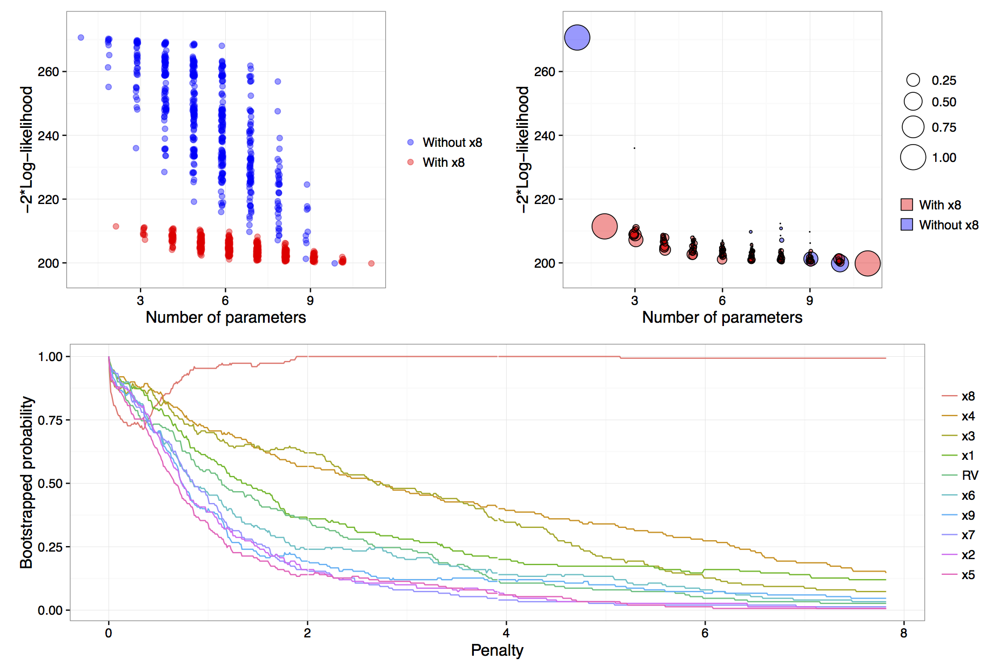

> Overview of model stability plots.

In order to generate model stability and variable inclusion plots, the first step is to generate a `vis` object using the `vis()` function.  To generate a `vis` object for the artificial data example the fitted full model object along with some optional arguments are passed to the `vis()` function.

```s
lm.art = lm(y ~ ., data = artificialeg)
vis.art = vis(lm.art, B = 150, redundant = TRUE, nbest = "all")
```

<div id="fig:plotvis">


</div>
_Figure: results of calls to `plot(vis.art, interactive = FALSE)` with additional arguments `which = "lvk"` in the top left, `which = "boot"` in the top right and `which = "vip"` down the bottom._

The `B = 150` argument provided to the `vis()` function tells us that we want to perform 150 bootstrap replications.  See @Murray:2013 for more detail on the use of exponential weights in bootstrap model selection.    Specifying `redundant = TRUE` is unnecessary, as it is the default option; it ensures that an extra variable, randomly generated from a standard normal distribution and hence completely unrelated to the true data generating process, is added to the full model.  This extra redundant variable can be used as a baseline comparison in the variable inclusion plots. Finally, the `nbest` argument controls how many models with the smallest $\hat{Q}(\alpha)$ for each model size $k=1,\ldots,p$ are recorded.  It can take an integer argument or specifying `nbest = "all"` ensures that all possible models are displayed when the plot methods is called, as shown in the top left panel of the [figure above](#fig:plotvis). Typically researchers do not need to visualise the entire model space and in problems with larger numbers of candidate variables it is impractical to store and plot results for all models.  The default behaviour of the `vis()` function is to set `nbest = 5`, essentially highlighting the maximum enveloping lower convex curve of @Murray:2013.    

The simplest visualisation of the model space is to plot a measure of description loss against model complexity for all possible models, a special implementation is the Mallows $C_p$ plot [@Mallows:2000]. This is done using the argument `which = "lvk"` to the plot function applied to a `vis` object.  The string `"lvk"` is short for loss versus $k$, the dimension of the model.

```s
plot(vis.art, interactive = FALSE, highlight = "x8", which = "lvk")
```

The result of this function can be found in the top left panel of the [figure above](#fig:plotvis).  The `highlight` argument is used to differentiate models that contain a particular variable from those that do not.  This is an implementation of the _enriched scatter plot_ of @Murray:2013.  There is a clear separation between models that contain $x_8$ and those that do not, that is, all triangles are clustered towards the bottom with the circles above in a separate cluster.  There is no similar separation for the other explanatory variables (not shown).  These results strongly suggest that $x_8$ is the single most important variable.  For clarity the points have been jittered slightly along the horizontal axis, though the model sizes remain clearly differentiated. 

Rather than performing a single pass over the model space and plotting the description loss against model size, a more nuanced and discerning approach is to use a (exponential weighted) bootstrap to determine how often various models achieve the minimal loss for each model size.  The advantage of the bootstrap approach is that it gives a measure of model stability for each model size as promoted by  @Meinshausen:2010, @Mueller:2010 and @Murray:2013.  

The weighted bootstrap has two key-benefits over the residual or nonparametric bootstrap: First, the weighted bootstrap always yields observable responses which is particularly relevant when these observable values are restricted to be integers (as in many generalized linear models), or, when $y$ values are naturally bounded, say to be observed on the interval 0 to 1; Second, the weighted bootstrap does not suffer from separation issues that regularly occur in logistic and other models.  The pairs bootstrap also yields observable responses and can be thought of as a special (boundary) case of the weighted bootstrap where some weights are allowed to be exactly zero, which can create a separation issue in logistic models.  Therefore, we have chosen to implement the weighted bootstrap because it is a simple, elegant method that appears to work well.  Specifically, we utilise the exponential weighted bootstrap where the observations are reweighted with weights drawn from an exponential distribution with mean 1 [see  @Murray:2013].

To visualise the results of the exponential weighted bootstrap, the `which = "boot"` argument needs to be passed to the plot call on a `vis` object.  The `highlight` argument can again be used to distinguish between models with and without a particular variable.  Each circle represents a model with a non-zero bootstrap probability, that is, each model that was selected as the best model of a particular dimension in at least one bootstrap replication.  Furthermore, the area of each circle is proportional to the corresponding model's bootstrapped selection probability.  

The top right panel of the [figure above](#fig:plotvis) is an example of a model stability plot for the artificial data set.  The null model, the full model and the simple linear regression of $y$ on $x_8$ all have bootstrap probabilities equal to one. While there are alternatives to the null and full model their inclusion in the plot serves two main purposes.  Firstly, to gauge the potential range in description loss and secondly to provide a baseline against which to compare other circles to see if any approach a similar size, which would indicate that those are dominant models of a given model dimension.  In the [figure above](#fig:plotvis), for model dimensions of between three and ten, there are no clearly dominant models, that is, within each model size there are no models that are selected much more commonly than the alternatives. 

A print method is available for `vis` objects which prints the model formula, log-likelihood and proportion of times that a given model was selected as the _best_ model within each model size.  The default minimum probability of a model being selected before it gets printed is 0.3, though this can be customised by passing a `min.prob` argument to the `print` function.

```s
print(vis.art, min.prob = 0.25)
```

```
                         name prob logLikelihood
                          y~1 1.00       -135.33
                         y~x8 1.00       -105.72
                      y~x4+x8 0.40       -103.63
                      y~x1+x8 0.27       -104.47
    y~x1+x2+x3+x4+x5+x6+x7+x9 0.26       -100.63
 y~x1+x2+x3+x4+x5+x6+x7+x9+RV 0.33       -100.51
```

The output above, reinforces what we know from the top right panel of the [figure above](#fig:plotvis).  The null model is always selected and in models of size two a regression of $y$ on $x_8$ is always selected.  In models of size three the two most commonly selected models are `y~x4+x8`, which was selected 40% of the time and `y~x1+x8` selected in 27% of bootstrap replications.  Interestingly, in models of size nine and ten, the most commonly selected models do not contain $x_8$, these are shown as blue circles in the plot.  We will see in the next section that this phenomenon is related to the failure of stepwise variable selection with this data set.  

#### References
