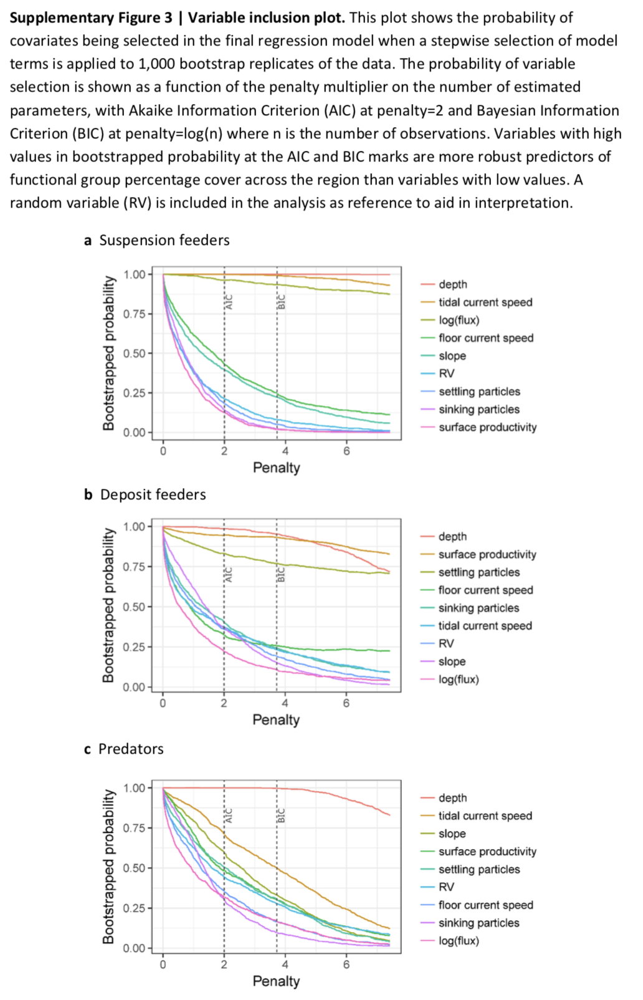

### Abundance and richness of key Antarctic seafloor fauna correlates with modelled food availability 

**Abstract**: Most seafloor communities at depths below the photosynthesis zone rely on food that sinks through the water column. However, the nature and strength of this pelagic–benthic coupling and its influence on the structure and diversity of seafloor communities is unclear, especially around Antarctica where ecological data are sparse. Here we show that the strength of pelagic–benthic coupling along the East Antarctic shelf depends on both physical processes and the types of benthic organisms considered. In an approach based on modelling food availability, we combine remotely sensed sea-surface chlorophyll-a, a regional ocean model and diatom abundances from sediment grabs with particle tracking and show that fluctuating seabed currents are crucial in the redistribution of surface productivity at the seafloor. The estimated availability of suspended food near the seafloor correlates strongly with the abundance of benthic suspension feeders, while the deposition of food particles correlates with decreasing suspension feeder richness and more abundant deposit feeders. The modelling framework, which can be modified for other regions, has broad applications in conservation and management, as it enables spatial predictions of key components of seafloor biodiversity over vast regions around Antarctica.

Jan Jansen, Nicole A. Hill, Piers K. Dunstan, John McKinlay, Michael D. Sumner, Alexandra L. Post, Marc P. Eléaume, Leanne K. Armand, Jonathan P. Warnock, Benjamin K. Galton-Fenzi & Craig R. Johnson (2017).  Abundance and richness of key Antarctic seafloor fauna correlates with modelled food availability, _Nature Ecology & Evolution_ **2**, 71-80. [doi:10.1038/s41559-017-0392-3](http://dx.doi.org/10.1038/s41559-017-0392-3)