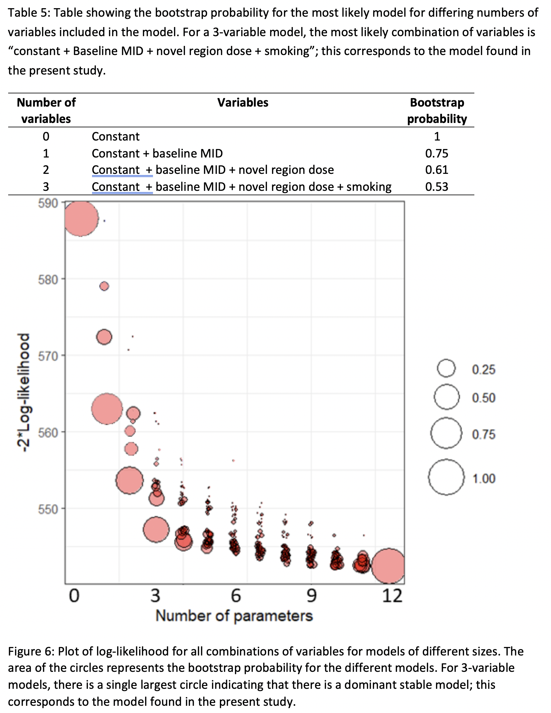

### Abundance and richness of key Antarctic seafloor fauna correlates with modelled food availability 

**Abstract**: Most seafloor communities at depths below the photosynthesis zone rely on food that sinks through the water column. However, the nature and strength of this pelagic–benthic coupling and its influence on the structure and diversity of seafloor communities is unclear, especially around Antarctica where ecological data are sparse. Here we show that the strength of pelagic–benthic coupling along the East Antarctic shelf depends on both physical processes and the types of benthic organisms considered. In an approach based on modelling food availability, we combine remotely sensed sea-surface chlorophyll-a, a regional ocean model and diatom abundances from sediment grabs with particle tracking and show that fluctuating seabed currents are crucial in the redistribution of surface productivity at the seafloor. The estimated availability of suspended food near the seafloor correlates strongly with the abundance of benthic suspension feeders, while the deposition of food particles correlates with decreasing suspension feeder richness and more abundant deposit feeders. The modelling framework, which can be modified for other regions, has broad applications in conservation and management, as it enables spatial predictions of key components of seafloor biodiversity over vast regions around Antarctica.

Jan Jansen, Nicole A. Hill, Piers K. Dunstan, John McKinlay, Michael D. Sumner, Alexandra L. Post, Marc P. Eléaume, Leanne K. Armand, Jonathan P. Warnock, Benjamin K. Galton-Fenzi & Craig R. Johnson (2017).  Abundance and richness of key Antarctic seafloor fauna correlates with modelled food availability, _Nature Ecology & Evolution_ **2**, 71-80. [doi:10.1038/s41559-017-0392-3](http://dx.doi.org/10.1038/s41559-017-0392-3)

 

### Image-based data mining to probe dosimetric correlates of radiation-induced trismus

***Abstract** 

#### Purpose

To identify imaged regions in which dose is associated with radiation-induced trismus after head and neck cancer radiation therapy (HNRT) using a novel image-based data mining (IBDM) framework.

#### Methods and Materials

A cohort of 86 HNRT patients were analyzed for region identification. Trismus was characterized as a continuous variable by the maximum incisor-to-incisor opening distance (MID) at 6 months after radiation therapy. Patient anatomies and dose distributions were spatially normalized to a common frame of reference using deformable image registration. IBDM was used to identify clusters of voxels associated with MID (P ≤ .05 based on permutation testing). The result was externally tested on a cohort of 35 patients with head and neck cancer. Internally, we also performed a dose-volume histogram–based analysis by comparing the magnitude of the correlation between MID and the mean dose for the IBDM-identified cluster in comparison with 5 delineated masticatory structures.

#### Results

A single cluster was identified with the IBDM approach (P < .01), partially overlapping with the ipsilateral masseter. The dose-volume histogram–based analysis confirmed that the IBDM cluster had the strongest association with MID, followed by the ipsilateral masseter and the ipsilateral medial pterygoid (Spearman’s rank correlation coefficients: Rs = −0.36, –0.35, −0.32; P = .001, .001, .002, respectively). External validation confirmed an association between mean dose to the IBDM cluster and MID (Rs = −0.45; P = .007).

#### Conclusions

IBDM bypasses the common assumption that dose patterns within structures are unimportant. Our novel IBDM approach for continuous outcome variables successfully identified a cluster of voxels that are highly associated with trismus, overlapping partially with the ipsilateral masseter. Tests on an external validation cohort showed an even stronger correlation with trismus. These results support use of the region in HNRT treatment planning to potentially reduce trismus.

William Beasley, Maria Thor, Alan McWilliam, Andrew Green, Ranald Mackay, Nick Slevin, Caroline Olsson, Niclas Pettersson, Caterina Finizia, Cherry Estilo, Nadeem Riaz, Nancy Y. Lee, Joseph O. Deasy & Marcel van Herk (2018). Image-based Data Mining to Probe Dosimetric Correlates of Radiation-induced Trismus,
_International Journal of Radiation Oncology*Biology*Physics_, 102(4), 1330-1338. [doi:10.1016/j.ijrobp.2018.05.054](https://doi.org/10.1016/j.ijrobp.2018.05.054)