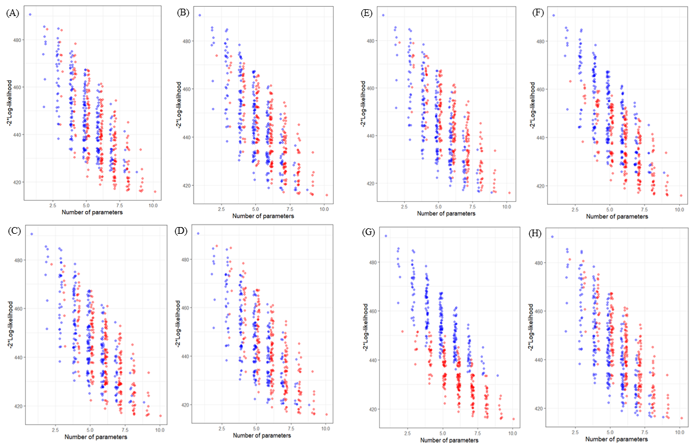

### Abundance and richness of key Antarctic seafloor fauna correlates with modelled food availability 

Most seafloor communities at depths below the photosynthesis zone rely on food that sinks through the water column. However, the nature and strength of this pelagic–benthic coupling and its influence on the structure and diversity of seafloor communities is unclear, especially around Antarctica where ecological data are sparse. Here we show that the strength of pelagic–benthic coupling along the East Antarctic shelf depends on both physical processes and the types of benthic organisms considered. In an approach based on modelling food availability, we combine remotely sensed sea-surface chlorophyll-a, a regional ocean model and diatom abundances from sediment grabs with particle tracking and show that fluctuating seabed currents are crucial in the redistribution of surface productivity at the seafloor. The estimated availability of suspended food near the seafloor correlates strongly with the abundance of benthic suspension feeders, while the deposition of food particles correlates with decreasing suspension feeder richness and more abundant deposit feeders. The modelling framework, which can be modified for other regions, has broad applications in conservation and management, as it enables spatial predictions of key components of seafloor biodiversity over vast regions around Antarctica.

Jan Jansen, Nicole A. Hill, Piers K. Dunstan, John McKinlay, Michael D. Sumner, Alexandra L. Post, Marc P. Eléaume, Leanne K. Armand, Jonathan P. Warnock, Benjamin K. Galton-Fenzi & Craig R. Johnson (2017).  Abundance and richness of key Antarctic seafloor fauna correlates with modelled food availability, _Nature Ecology & Evolution_ **2**, 71-80. [doi:10.1038/s41559-017-0392-3](http://dx.doi.org/10.1038/s41559-017-0392-3)

 

### Image-based data mining to probe dosimetric correlates of radiation-induced trismus

**Purpose**

To identify imaged regions in which dose is associated with radiation-induced trismus after head and neck cancer radiation therapy (HNRT) using a novel image-based data mining (IBDM) framework.

**Conclusions**

IBDM bypasses the common assumption that dose patterns within structures are unimportant. Our novel IBDM approach for continuous outcome variables successfully identified a cluster of voxels that are highly associated with trismus, overlapping partially with the ipsilateral masseter. Tests on an external validation cohort showed an even stronger correlation with trismus. These results support use of the region in HNRT treatment planning to potentially reduce trismus.

William Beasley, Maria Thor, Alan McWilliam, Andrew Green, Ranald Mackay, Nick Slevin, Caroline Olsson, Niclas Pettersson, Caterina Finizia, Cherry Estilo, Nadeem Riaz, Nancy Y. Lee, Joseph O. Deasy & Marcel van Herk (2018). Image-based data mining to probe dosimetric correlates of radiation-induced trismus,
_International Journal of Radiation Oncology, Biology, Physics_, **102**(4), 1330-1338. [doi:10.1016/j.ijrobp.2018.05.054](https://doi.org/10.1016/j.ijrobp.2018.05.054)

 

### How can the occurrence of delayed elevation of thyroid stimulating hormone in preterm infants born between 35 and 36 weeks gestation be predicted?

**Objective**

We evaluated frequency and risk factors of delayed TSH elevation (dTSH) and investigated follow-up outcomes in the dTSH group with venous TSH (v-TSH) levels of 6–20 mU/L according to whether late preterm infants born at gestational age (GA) 35–36 weeks had risk factors.

**Conclusions**

dTSH was detected in 9.0% and levothyroxine was indicated in 1.5% of infants born at GA 35–36 weeks, particularly those with a LBW, a congenital anomaly, or history of ICM exposure. Either levothyroxine or retesting is indicated for late preterm neonates with TSH levels ≥10 mU/L regardless of risk factors. If healthy preterm neonates show v-TSH levels of 6–10 mU/L, a second repeat test may not be necessary; however, further studies are required to set a threshold for retesting.

Heo YJ, Lee YA, Lee B, Lee YJ, Lim YH, Chung HR, et al. (2019) How can the occurrence of delayed elevation of thyroid stimulating hormone in preterm infants born between 35 and 36 weeks gestation be predicted? _PLoS ONE_ **14**(8): e0220240. (10.1371/journal.pone.0220240)[https://doi.org/10.1371/journal.pone.0220240]