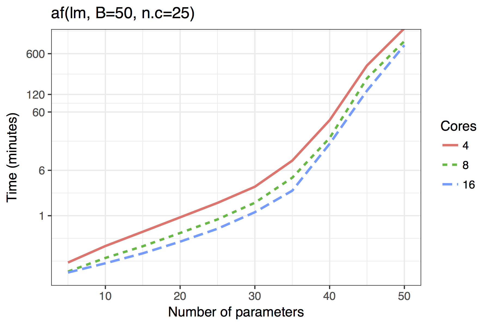
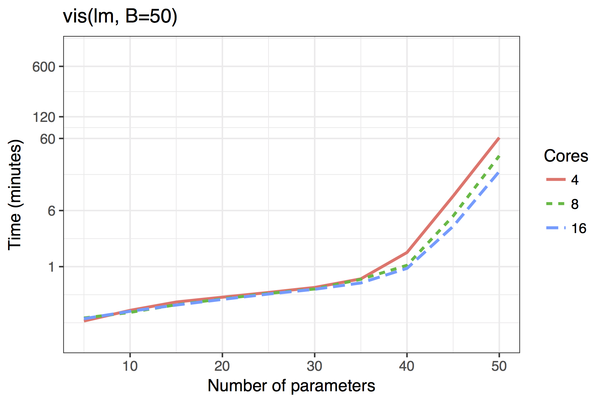
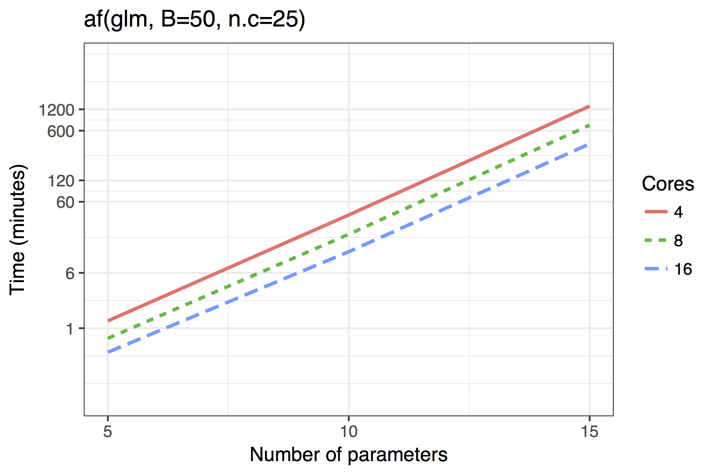
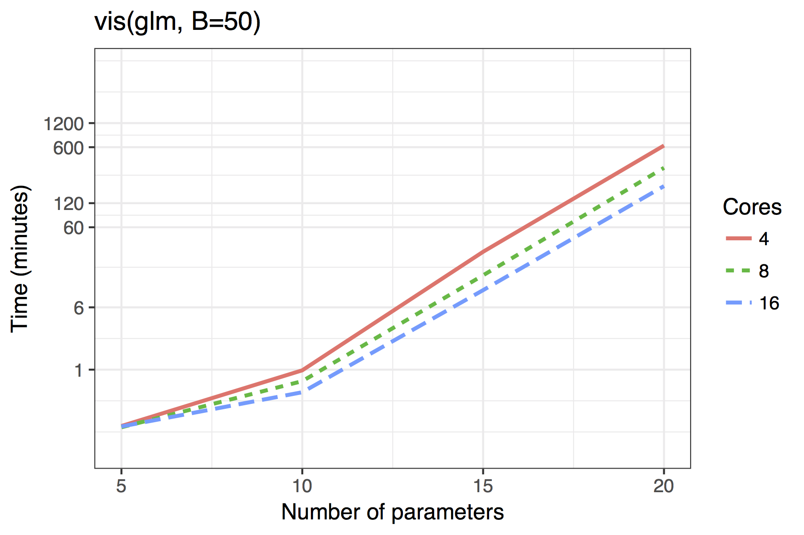

Any bootstrap model selection procedure is time consuming.  However, for linear models, we have leveraged the efficiency of the branch-and-bound algorithm provided by **leaps** [@Lumley:2009; @Miller:2002].  The **bestglm** package is used for GLMs; but in the absence of a comparably efficient algorithm the computational burden is much greater [@McLeod:2014].

Furthermore, we have taken advantage of the embarrassingly parallel nature of bootstrapping, utilising the [**doParallel**](https://cran.r-project.org/package=doParallel) and [**foreach**](https://cran.r-project.org/package=foreach) packages to provide cross platform multicore support, available through the `cores` argument.  By default it will detect the number of cores available on your computer and leave one free.

Figure \ref{fig:time} shows the timing results of simulations run for standard use scenarios with 4, 8 or 16 cores used in parallel.  Each observation plotted is the average of four runs of a given model size. The simulated models had a sample size of $n=100$ with $5,10,\ldots,50$ candidate variables, of which 30% were active in the true model.

The results show both the `vis()` and `af()` functions are quite feasible on standard desktop hardware with 4 cores even for moderate dimensions of up to 40 candidate variables.  The adaptive fence takes longer than the `vis()` function, though this is to be expected as the effective number of bootstrap replications is `B`$\times$`n.c`, where `n.c` is the number divisions in the grid of the parameter $c$.

The results for GLMs are far less impressive, even when the maximum dimension of a candidate solution is set to `nvmax = 10`.  In its current implementation, the adaptive fence is only really feasible for models of around 10 predictors and the `vis()` function for 15.  Future improvements could see approximations of the type outlined by \citet{Hosmer:1989} to bring the power of the linear model branch-and-bound algorithm to GLMs.  An example of how this works in practice is given in Section \ref{sec:bw}.

An alternative approach for high dimensional models would be to consider subset selection with convex relaxations as in \citet{Shen:2012} or combine bootstrap model selection with regularisation.  In particular, we have implemented variable inclusion plots and model stability plots for **glmnet** [@Shen:2012].  In general, this is very fast for models of moderate dimension, but it does not consider the full model space.  Restrictions within the **glmnet** package, mean it is only applicable to linear models, binomial logistic regression, and Poisson regression with the log link function.  The **glmnet** package also allows for `"multinomial"`, `"cox"`, and `"mgaussian"` families, though we have not yet incorporated these into the **mplot** package.

_Average time required to run the `af()` and `vis()` functions when $n=100$.  A binomial regression was used for the GLM example._

#### References

